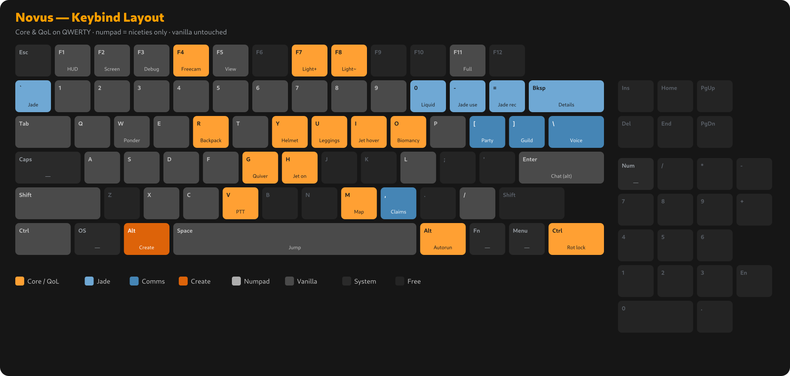

# Novus

**A Create-focused progression pack for Minecraft 1.20.1 (Forge).**

Novus builds one connected playthrough out of a handful of big mods rather than
throwing everything at you at once. Create runs the machines and automation.
Tinkers' Construct handles tools and materials. Farmer's Delight turns cooking
into a system of its own, and Quark, Supplementaries, and the Macaw's mods fill
the world with things to build. Magic splits two ways: Botania, the flower-based
path that grows out of the farming side, and Biomancy, the flesh-and-bio path
that wires into Create.

It's a focused pack, not a kitchen sink. There's no combat overhaul, no quest
book to grind through, and no tech tree that races past Create. What ties it all
together is a large set of compatibility mods working quietly in the background
so these systems understand each other.

`Minecraft 1.20.1` · `Forge 47.4.20` · `Java 17` · **<!-- BEGIN:MODCOUNT -->195<!-- END:MODCOUNT --> mods**

---

## Install

**Self-updating (recommended).** Download
**[`novus.zip`](https://b1ll3b0b.github.io/novus/novus.zip)**
and import it into Prism or MultiMC (Add Instance → Import from zip). A small
pre-launch step keeps it current: import once, and every launch pulls the latest
mods and configs for you. That link is permanent and the pack self-updates on
every launch, so it never goes stale.

**Standalone download.** Prefer a fixed version? Grab
`novus-<version>-complete.zip` (client / singleplayer) or
`novus-<version>-server.zip` (dedicated server) from the
[Releases page](https://github.com/b1ll3b0b/novus/releases).

**packwiz.** Point a packwiz-installer at the published `pack.toml`.

---

## Keybinds

Novus ships a tuned, conflict-free keybind layout that applies itself on first
launch. The main keyboard holds the core systems and quality-of-life keys, the
numpad is reserved for extras, and vanilla controls are left alone.

**Dvorak users:** a positional-transpose version of this layout ships alongside the default at `config/defaultoptions/keybindings-dvorak.txt` — every action sits on the same *physical* key as the QWERTY layout above. To use it, replace `config/defaultoptions/keybindings.txt` with that file **before your first launch**. Default Options applies the defaults only once, on first boot, so swapping it afterward won't take effect (you'd just rebind in-game instead).

---

## Lost Cities (optional)

Novus bundles **The Lost Cities** (by McJty) with a custom **`novus`** profile that
overlays sprawling abandoned cities onto the ordinary overworld — the vanilla biome
and terrain layout is untouched, the ruins are laid over the top of it, so vanilla
seeds and structure locations still hold.

In **singleplayer it's off by default.** To play with it, open the **Lost Cities**
customization on the world-creation screen and switch the profile from *Disabled* to
**`novus`** before generating the world. (The menu always starts on *Disabled* — that's
a Lost Cities quirk, not a missing profile; the `novus` profile ships with the pack.)

On the **dedicated server** the `novus` profile is forced on for everyone, so the
whole group shares one city-strewn world.

---

## Licensing & credits — please read

Everything below belongs to its original author and is included under that
author's own license. Three things worth knowing up front:

- **Most mods are included as metadata, not files.** For the 177 mods hosted on
  Modrinth, Novus ships only a download link and a file hash. Installing the pack
  fetches each one from its official source, so the pack itself re-hosts nothing
  for those mods.
- **The 20 CurseForge mods are bundled as actual jars.** Automated installers
  can't fetch CurseForge by metadata, so those jars are included directly in the
  pack. Several of them are All Rights Reserved (Waystones, Balm, Quark Delight,
  and others). Credit goes to each author, linked in the table below.
- **Resource packs are bundled as files too**, and some of their source packs are
  All Rights Reserved. See the resource-pack section for the details and a
  release caveat.

Novus started out aiming to be all open source. In practice it landed at roughly
two-thirds open, with the rest being popular All Rights Reserved content and a
few source-available licenses (Create, Supplementaries, Botania). That mix is
normal for a Forge pack, and it's all disclosed here.

> This isn't legal advice. Licenses were read from each project's listing and/or
> the mod's own metadata, and the trickier ones were checked against the
> project's actual LICENSE file. If you spot a mistake, please open an issue.

**License mix:**

<!-- BEGIN:LICENSEMIX -->
Across all 195 mods:

| License type | Count |
|---|---|
| Open source (MIT, Apache, LGPL/GPL, MPL, BSD, OSL, CC0/CC-BY, etc.) | 133 |
| All rights reserved | 42 |
| Custom / source-available (Create, Supplementaries, Botania, PolyForm, etc.) | 13 |
| Creative Commons non-commercial (Quark family, Jade, the compasses) | 7 |
<!-- END:LICENSEMIX -->

---

## Mods

<!-- BEGIN:MODS -->
_195 mods. This table is generated from the jars and packwiz metadata by `tools/readme/build_readme_credits.py` — don't edit it by hand._

| Mod | Author(s) | License | Source |
|---|---|---|---|
| AgriCraft | InfinityRaider, Ketheroth | MIT | [Modrinth](https://modrinth.com/mod/agricraft) |
| Amendments | MehVahdJukaar | Custom — Supplementaries Team License [^1] | [Modrinth](https://modrinth.com/mod/amendments) |
| Another Furniture | Starfish Studios | Custom [^2] | [Modrinth](https://modrinth.com/mod/another-furniture) |
| Antique Atlas | Hunternif, tyra314, Sisby folk. Contributions by Kenkron, asiekierka, Haven King, TheCodeWarrior, osipxd, coolAlias, TehNut, lumiscosity, frodolon | LGPL-3.0-or-later | [Modrinth](https://modrinth.com/mod/antique-atlas-4) |
| AppleSkin | squeek | Unlicense | [Modrinth](https://modrinth.com/mod/appleskin) |
| Architectury | shedaniel | LGPL-3.0-only | [Modrinth](https://modrinth.com/mod/architectury-api) |
| Argonauts | Alex Nijjar, ThatGravyBoat | MIT | [Modrinth](https://modrinth.com/mod/argonauts) |
| Auroras | Verph | BSD-2-Clause | [Modrinth](https://modrinth.com/mod/auroras) |
| Backpacked | MrCrayfish | LGPL-2.1-only | [CurseForge](https://www.curseforge.com/minecraft/mc-mods/backpacked) |
| Balm | BlayTheNinth | All Rights Reserved | [CurseForge](https://www.curseforge.com/minecraft/mc-mods/balm) |
| Bartering Station | Fuzs | MPL-2.0 | [Modrinth](https://modrinth.com/mod/bartering-station) |
| Better Combat | Daedelus | GPL-3.0 [^3] | [Modrinth](https://modrinth.com/mod/better-combat) |
| Better Third Person | Socolio | All Rights Reserved | [Modrinth](https://modrinth.com/mod/better-third-person) |
| BetterDays | wendall911 | LGPL-3.0-or-later | [Modrinth](https://modrinth.com/mod/betterdays) |
| Bio-Factory | Elenterius | MIT | [Modrinth](https://modrinth.com/mod/biofactory) |
| Biomancy 2 | Elenterius, RhinoW | MIT | [Modrinth](https://modrinth.com/mod/biomancy) |
| Biomantic Delight | thesh, MCreator | All Rights Reserved | [Modrinth](https://modrinth.com/mod/bio-delight) |
| Bookshelf | Darkhax | LGPL-2.1-only | [Modrinth](https://modrinth.com/mod/bookshelf-lib) |
| Botania | Vazkii, wiiv, williewillus, dylan4ever, Hubry, Alwinfy, artemisSystem, Falkory220 | Custom — Botania License | [Modrinth](https://modrinth.com/mod/botania) |
| Bountiful | Ejektaflex | GPL-3.0 [^4] | [Modrinth](https://modrinth.com/mod/bountiful) |
| Brewin' And Chewin' | Probleyes, Umpaz, MerchantPug | MIT | [Modrinth](https://modrinth.com/mod/brewin-and-chewin) |
| Cadmus | Alex Nijjar, ThatGravyBoat | MIT | [Modrinth](https://modrinth.com/mod/cadmus) |
| Canary | AbdElAziz | LGPL-3.0-only | [Modrinth](https://modrinth.com/mod/canary) |
| Catalogue | MrCrayfish | MIT | [CurseForge](https://www.curseforge.com/minecraft/mc-mods/catalogue) |
| Ceramics | KnightMiner | MIT | [Modrinth](https://modrinth.com/mod/ceramics) |
| Chalk | mortuusars | MIT | [Modrinth](https://modrinth.com/mod/chalk-mod) |
| Chefs Delight | Redstone Games | MIT | [Modrinth](https://modrinth.com/mod/chefs-delight) |
| Cherished Worlds | Illusive Soulworks | LGPL-3.0-or-later | [Modrinth](https://modrinth.com/mod/cherished-worlds) |
| Chunky | pop4959 | GPL-3.0 | [Modrinth](https://modrinth.com/mod/chunky) |
| Cloth Config v10 API | shedaniel | LGPL-3.0-only | [Modrinth](https://modrinth.com/mod/cloth-config) |
| Collective | Rick South | All Rights Reserved | [Modrinth](https://modrinth.com/mod/collective) |
| Comforts | Illusive Soulworks | LGPL-3.0-or-later | [Modrinth](https://modrinth.com/mod/comforts) |
| Compat Delight | FixerLink | All Rights Reserved | [Modrinth](https://modrinth.com/mod/compat-delight) |
| Configured | MrCrayfish | LGPL-3.0-only | [CurseForge](https://www.curseforge.com/minecraft/mc-mods/configured) |
| Controllable | MrCrayfish | MIT | [CurseForge](https://www.curseforge.com/minecraft/mc-mods/controllable) |
| Controlling | Jaredlll08 | MIT | [Modrinth](https://modrinth.com/mod/controlling) |
| CraftTweaker | Jaredlll08, Kindlich, StanHebben and TheSilkMiner | MIT | [Modrinth](https://modrinth.com/mod/crafttweaker) |
| Create | simibubi | Custom — Create Mod License [^6] | [Modrinth](https://modrinth.com/mod/create) |
| Create Contraption Terminals | tom5454 | MIT | [Modrinth](https://modrinth.com/mod/create-contraption-terminals) |
| Create Crafts & Additions | MRH0 | MIT | [Modrinth](https://modrinth.com/mod/createaddition) |
| Create Deco | Kayla, Talrey, Ordana, Cassian | CC0-1.0 [^9] | [Modrinth](https://modrinth.com/mod/create-deco) |
| Create Enchantment Industry | MarbleGateKeeper & LimonBlaze | LGPL-3.0-only [^7] | [Modrinth](https://modrinth.com/mod/create-enchantment-industry) |
| Create Hypertube | Rok | Apache-2.0 | [Modrinth](https://modrinth.com/mod/hypertube) |
| Create Jetpack | possible_triangle | Custom (source-available) [^8] | [Modrinth](https://modrinth.com/mod/create-jetpack) |
| Create Recycle Everything | NoCube | All Rights Reserved | [CurseForge](https://www.curseforge.com/minecraft/mc-mods/create-recycle-everything) |
| Create: Bells & Whistles | lev | GPL-3.0-or-later | [Modrinth](https://modrinth.com/mod/bellsandwhistles) |
| Create: Blaze Burner Fuels | robinfrt | All Rights Reserved | [Modrinth](https://modrinth.com/mod/create-blaze-burner-fuels) |
| Create: Central Kitchen | LimonBlaze, MarbleGate and Etherwood | LGPL-3.0-only [^7] | — |
| Create: Connected | Lysine | AGPL-3.0-or-later | [Modrinth](https://modrinth.com/mod/create-connected) |
| Create: Copycats+ | Lysine, Bennyboy1695, Redcat_XVIII | All Rights Reserved | [Modrinth](https://modrinth.com/mod/copycats) |
| Create: Diesel Generators | George VI | MIT | [Modrinth](https://modrinth.com/mod/create-diesel-generators) |
| Create: Escalated | rbasamoyai | MIT | [Modrinth](https://modrinth.com/mod/escalated) |
| Create: Power Loader | Lysine | MIT | [Modrinth](https://modrinth.com/mod/create-power-loader) |
| Create: Sound of Steam | FinchyMcFinch, Deanosaur75 | MIT [^12] | [Modrinth](https://modrinth.com/mod/create-sound-of-steam) |
| Create: Steam 'n' Rails | The Railways Team | LGPL-3.0-only | [Modrinth](https://modrinth.com/mod/create-steam-n-rails) |
| Create: Vibrant Vaults | ZLT | MIT | [Modrinth](https://modrinth.com/mod/create-vibrant-vaults) |
| CreateArmory | dcchill | All Rights Reserved | [Modrinth](https://modrinth.com/mod/create-armory) |
| Curios API | C4 | LGPL-3.0-or-later | [Modrinth](https://modrinth.com/mod/curios) |
| Default Options | BlayTheNinth | All Rights Reserved | [Modrinth](https://modrinth.com/mod/default-options) |
| Diagonal Fences | Fuzs, XFactHD | MPL-2.0 | [Modrinth](https://modrinth.com/mod/diagonal-fences) |
| Diagonal Walls | Fuzs, XFactHD | MPL-2.0 | [Modrinth](https://modrinth.com/mod/diagonal-walls) |
| Diagonal Windows | Fuzs, XFactHD | MPL-2.0 | [Modrinth](https://modrinth.com/mod/diagonal-windows) |
| Dynamic Trees | Ferreusveritas | MIT | [Modrinth](https://modrinth.com/mod/dynamictrees) |
| Dynamic Trees for Quark | Max Hyper | MIT | [Modrinth](https://modrinth.com/mod/dynamic-trees-quark) |
| Dynamic Trees for Tinker's Construct | Max Hyper | MIT | [CurseForge](https://www.curseforge.com/minecraft/mc-mods/dynamic-trees-tinkers-construct) |
| Dynamic Trees Plus | Ferreusveritas, Max Hyper/supermassimo, Harley O'Connor | MIT | [Modrinth](https://modrinth.com/mod/dynamictreesplus) |
| Embeddium | embeddedt | LGPL-3.0-only | [Modrinth](https://modrinth.com/mod/embeddium) |
| EMI | Emi | MIT | [Modrinth](https://modrinth.com/mod/emi) |
| EnchantmentDescriptions | Darkhax | LGPL-2.1-only | [Modrinth](https://modrinth.com/mod/enchantment-descriptions) |
| EnderChests | ShetiPhian; Artwork: Fruzstrated | All Rights Reserved | [Modrinth](https://modrinth.com/mod/enderchests) |
| EnderTanks | ShetiPhian; Artwork: Fruzstrated | All Rights Reserved | [Modrinth](https://modrinth.com/mod/endertanks) |
| Entity Model Features | Traben | LGPL-3.0-only | [Modrinth](https://modrinth.com/mod/entity-model-features) |
| Entity Texture Features | Traben | LGPL-3.0-only | [Modrinth](https://modrinth.com/mod/entitytexturefeatures) |
| EntityCulling | tr7zw | Custom — tr7zw Protective License | [Modrinth](https://modrinth.com/mod/entityculling) |
| Every Compat | MehVahdJukaar, Xel'Bayria, WenXin2 | Custom — Supplementaries Team License [^1] | [Modrinth](https://modrinth.com/mod/every-compat) |
| Explorer's Compass | ChaosTheDude | CC-BY-NC-SA-4.0 | [Modrinth](https://modrinth.com/mod/explorers-compass) |
| Exposure | mortuusars | MIT | [Modrinth](https://modrinth.com/mod/exposure) |
| Exposure Polaroid | mortuusars | MIT | [Modrinth](https://modrinth.com/mod/exposure-polaroid) |
| FA Player Extension Compat | ArimoV2 | MPL-2.0 | [Modrinth](https://modrinth.com/mod/fa-player-extension-compat) |
| Farmer's Delight | vectorwing | MIT | [Modrinth](https://modrinth.com/mod/farmers-delight) |
| Farmer's Delight: Plus | Johnyele | MIT | [Modrinth](https://modrinth.com/mod/farmers-delight-plus) |
| Farmer's Respite | Umpaz, Probleyes | MIT | [CurseForge](https://www.curseforge.com/minecraft/mc-mods/farmers-respite) |
| Ferrite Core | malte0811 | MIT | [Modrinth](https://modrinth.com/mod/ferrite-core) |
| Forgified Fabric API | FabricMC, Sinytra | Apache-2.0 | [Modrinth](https://modrinth.com/mod/forgified-fabric-api) |
| Framework | MrCrayfish | LGPL-2.1-only | [CurseForge](https://www.curseforge.com/minecraft/mc-mods/framework) |
| Freecam | hashalite | MIT | [Modrinth](https://modrinth.com/mod/freecam) |
| Fright's Delight | ChefMooon | MIT | [Modrinth](https://modrinth.com/mod/frights-delight) |
| Fusion | SuperMartijn642 | All Rights Reserved | [Modrinth](https://modrinth.com/mod/fusion-connected-textures) |
| Fzzy Config | fzzyhmstrs | Custom — TDL-M | [Modrinth](https://modrinth.com/mod/fzzy-config) |
| Gabou's Libs | Gabou | All Rights Reserved | [Modrinth](https://modrinth.com/mod/gabous-libs) |
| GeckoLib 4 | Gecko, Eliot, AzureDoom, DerToaster, Tslat, Witixin | MIT | [Modrinth](https://modrinth.com/mod/geckolib) |
| GlitchCore | Adubbz | All Rights Reserved | [Modrinth](https://modrinth.com/mod/glitchcore) |
| Goblin Traders | MrCrayfish | MIT | [CurseForge](https://www.curseforge.com/minecraft/mc-mods/goblin-traders) |
| Hide Experimental Warning | Rick South | All Rights Reserved | [Modrinth](https://modrinth.com/mod/hide-experimental-warning) |
| Hyperbox | Commoble | MIT | [Modrinth](https://modrinth.com/mod/hyperbox) |
| ImmediatelyFast | RK_01 | LGPL-3.0-only | [Modrinth](https://modrinth.com/mod/immediatelyfast) |
| Immersive Gateways | Luke100000 | GPL-3.0 | [Modrinth](https://modrinth.com/mod/immersive-gateways) |
| Infinity Buttons | LarsMans | MIT | [Modrinth](https://modrinth.com/mod/infinitybuttons) |
| Initial Inventory | Jaredlll08 | MIT | [CurseForge](https://www.curseforge.com/minecraft/mc-mods/initial-inventory) |
| Jade | Snownee | CC-BY-NC-SA-4.0 | [Modrinth](https://modrinth.com/mod/jade) |
| Jade Addons | Snownee | All Rights Reserved | [Modrinth](https://modrinth.com/mod/jade-addons-forge) |
| Json Things | gigaherz | BSD-3-Clause | [CurseForge](https://www.curseforge.com/minecraft/mc-mods/json-things) |
| Just Enough Breeding | Christofmeg | MIT | [Modrinth](https://modrinth.com/mod/justenoughbreeding) |
| Just Enough Effects Descriptions | MehVahdJukaar | All Rights Reserved | [Modrinth](https://modrinth.com/mod/just-enough-effect-descriptions-jeed) |
| Just Enough Professions (JEP) | Mrbysco, ShyNieke | MIT | [Modrinth](https://modrinth.com/mod/just-enough-professions-jep) |
| Kambrik | enjarai | MPL-2.0 [^10] | [Modrinth](https://modrinth.com/mod/kambrik) |
| Kotlin For Forge | — | LGPL-2.1-only | [Modrinth](https://modrinth.com/mod/kotlin-for-forge) |
| KubeJS | LatvianModder | LGPL-3.0-only | [Modrinth](https://modrinth.com/mod/kubejs) |
| KubeJS Addditions (Forge) | ILIKEPIEFOO2 | All Rights Reserved [^11] | [Modrinth](https://modrinth.com/mod/kubejs-additions) |
| KubeJS Create | LatvianModder | LGPL-3.0-only | [Modrinth](https://modrinth.com/mod/kubejs-create) |
| KubeJSDelight | QinomeD, Bob Varioa | LGPL-3.0-only | [CurseForge](https://www.curseforge.com/minecraft/mc-mods/kubejs-delight) |
| Leaves Be Gone | Fuzs | MPL-2.0 | [Modrinth](https://modrinth.com/mod/leaves-be-gone) |
| Lighty | andi_makes, agnor99 | Apache-2.0 | [Modrinth](https://modrinth.com/mod/lighty) |
| Macaw's Bridges | Sketch Macaw & Peachy Macaw | All Rights Reserved | [Modrinth](https://modrinth.com/mod/macaws-bridges) |
| Macaw's Doors | Sketch Macaw & Sketch Peachy | MIT | [Modrinth](https://modrinth.com/mod/macaws-doors) |
| Macaw's Fences and Walls | Sketch Macaw & Peachy Macaw | MIT | [Modrinth](https://modrinth.com/mod/macaws-fences-and-walls) |
| Macaw's Holidays | Sketch Macaw & Peachy Macaw | All Rights Reserved | [Modrinth](https://modrinth.com/mod/macaws-holidays) |
| Macaw's Lights and Lamps | Sketch Macaw & Peachy Macaw | All Rights Reserved | [Modrinth](https://modrinth.com/mod/macaws-lights-and-lamps) |
| Macaw's Paths and Pavings | Sketch Macaw & Peachy Macaw | MIT | [Modrinth](https://modrinth.com/mod/macaws-paths-and-pavings) |
| Macaw's Roofs | Sketch Macaw & Sketch Peachy | All Rights Reserved | [Modrinth](https://modrinth.com/mod/macaws-roofs) |
| Macaw's Stairs and Balconies | Sketch Macaw & Sketch Peachy | All Rights Reserved | [Modrinth](https://modrinth.com/mod/macaws-stairs) |
| Macaw's Trapdoors | Sketch Macaw & Peachy Macaw | MIT | [Modrinth](https://modrinth.com/mod/macaws-trapdoors) |
| Macaw's Windows | Sketch Macaw & Peachy Macaw | All Rights Reserved | [Modrinth](https://modrinth.com/mod/macaws-windows) |
| Mantle | Slime Knights | MIT | [Modrinth](https://modrinth.com/mod/mantle) |
| Map Atlases | MehVahdJukaar, Pepperoni__Jabroni__ | GPL-3.0 | [Modrinth](https://modrinth.com/mod/map-atlases-forge) |
| Miner's Delight | Sammy; | All Rights Reserved | [Modrinth](https://modrinth.com/mod/miners-delight) |
| MmmMmmMmmMmm | MehVahdJukaar, Bonusboni, Plantkillable | CC0-1.0 | [Modrinth](https://modrinth.com/mod/mmmmmmmmmmmm) |
| ModernFix | embeddedt | LGPL-3.0-only | [Modrinth](https://modrinth.com/mod/modernfix) |
| Moonlight Library | MehVahdJukaar | Custom — LGPL + dependency clause | [Modrinth](https://modrinth.com/mod/moonlight) |
| More Create Burners | Dragon Egg | All Rights Reserved | [Modrinth](https://modrinth.com/mod/more-create-burners) |
| More Red | Commoble | MIT | [Modrinth](https://modrinth.com/mod/more-red) |
| Mouse Tweaks | Ivan Molodetskikh (YaLTeR) | BSD-3-Clause | [Modrinth](https://modrinth.com/mod/mouse-tweaks) |
| Nature's Compass | ChaosTheDude | CC-BY-NC-SA-4.0 | [Modrinth](https://modrinth.com/mod/natures-compass) |
| Oculus | NanoLive, dima_dencep, coderbot, IMS212, Justsnoopy30, FoundationGames | LGPL-3.0-only | [Modrinth](https://modrinth.com/mod/oculus) |
| Particle Rain | pigcart | MIT | [Modrinth](https://modrinth.com/mod/particle-rain) |
| Patchouli | Vazkii | CC-BY-NC-SA-3.0 | [Modrinth](https://modrinth.com/mod/patchouli) |
| Paxi | YUNGNICKYOUNG | LGPL-3.0-only | [Modrinth](https://modrinth.com/mod/paxi) |
| Pehkui | Virtuoel | MIT | [Modrinth](https://modrinth.com/mod/pehkui) |
| Petrol's Parts | petrolpark | All Rights Reserved | [Modrinth](https://modrinth.com/mod/petrols-parts) |
| Petrolpark's Library | petrolpark | All Rights Reserved | [Modrinth](https://modrinth.com/mod/petrolpark) |
| Placebo | Shadows_of_Fire | MIT | [CurseForge](https://www.curseforge.com/minecraft/mc-mods/placebo) |
| Player Animator | KosmX | MIT | [Modrinth](https://modrinth.com/mod/playeranimator) |
| Plenty Plates | Fuzs | MPL-2.0 | [Modrinth](https://modrinth.com/mod/plenty-plates) |
| PolyLib | CreeperHost | BSD-4-Clause [^13] | [Modrinth](https://modrinth.com/mod/polylib) |
| Polymorph | Illusive Soulworks | LGPL-3.0-or-later | [Modrinth](https://modrinth.com/mod/polymorph) |
| PonderJS | kotakotik22, AlmostReliable | MIT | [Modrinth](https://modrinth.com/mod/ponder) |
| Powah | owmii,Technici4n | LGPL-3.0-only | [Modrinth](https://modrinth.com/mod/powah) |
| Puzzles Lib | Fuzs | MPL-2.0 | [Modrinth](https://modrinth.com/mod/puzzles-lib) |
| Quark | Vazkii, WireSegal, MCVinnyq, Sully | CC-BY-NC-SA-3.0 | [Modrinth](https://modrinth.com/mod/quark) |
| Quark Delight | NoCube | All Rights Reserved | [CurseForge](https://www.curseforge.com/minecraft/mc-mods/quark-delight) |
| Quark Oddities | Vazkii, WireSegal, MCVinnyq, Sully | CC-BY-NC-SA-3.0 | [Modrinth](https://modrinth.com/mod/quark-oddities) |
| Rainbows | Verph | BSD-2-Clause | [Modrinth](https://modrinth.com/mod/rainboows) |
| Repurposed Structures | TelepathicGrunt | LGPL-3.0-only | [Modrinth](https://modrinth.com/mod/repurposed-structures-forge) |
| Resourceful Lib | ThatGravyBoat, Epic_Oreo | MIT | [Modrinth](https://modrinth.com/mod/resourceful-lib) |
| Resourcefulconfig | ThatGravyBoat, Epic_Oreo | MIT [^14] | [Modrinth](https://modrinth.com/mod/resourceful-config) |
| Rhino | latvian.dev, Mozilla | MPL-2.0 | [Modrinth](https://modrinth.com/mod/rhino) |
| Saturn | AbdElAziz | LGPL-3.0-only | [Modrinth](https://modrinth.com/mod/saturn) |
| Scarecrows' Territory | SuperMartijn642 | All Rights Reserved | [Modrinth](https://modrinth.com/mod/scarecrows-territory) |
| Searchables | Jaredlll08 | MIT | [Modrinth](https://modrinth.com/mod/searchables) |
| Serene Seasons | Adubbz, Forstride | All Rights Reserved | [Modrinth](https://modrinth.com/mod/serene-seasons) |
| Serene Seasons Plus | Gabou | All Rights Reserved | [Modrinth](https://modrinth.com/mod/serene-seasons-plus) |
| ShetiPhian-Core | ShetiPhian, Artwork: Fruzstrated | All Rights Reserved | [Modrinth](https://modrinth.com/mod/shetiphiancore) |
| Simple Clouds | nonamecrackers2 | PolyForm Perimeter 1.0.1 | [Modrinth](https://modrinth.com/mod/simple-clouds) |
| Simple Clouds Compat | RedCraft86 | MIT | [Modrinth](https://modrinth.com/mod/simple-clouds-compat) |
| Simple Voice Chat | Max Henkel | All Rights Reserved | [Modrinth](https://modrinth.com/mod/simple-voice-chat) |
| Sinytra Connector | Sinytra | MIT [^5] | [Modrinth](https://modrinth.com/mod/connector) |
| Sodium Dynamic Lights | toni, LambdAurora | MIT | [Modrinth](https://modrinth.com/mod/sodium-dynamic-lights) |
| Sodium Options API | toni | LGPL-3.0-only | [Modrinth](https://modrinth.com/mod/sodium-options-api) |
| Sound Physics Remastered | Sonic Ether, vlad2305m, Max Henkel, Saint | GPL-3.0 | [Modrinth](https://modrinth.com/mod/sound-physics-remastered) |
| Spice of Life: Classic Edition | leopoko | MIT | [Modrinth](https://modrinth.com/mod/foodvariations) |
| Storage Drawers | Texelsaur | MIT | [Modrinth](https://modrinth.com/mod/storagedrawers) |
| Subtle Effects | MincraftEinstein | All Rights Reserved | [Modrinth](https://modrinth.com/mod/subtle-effects) |
| SuperMartijn642's Config Library | SuperMartijn642 | All Rights Reserved | [Modrinth](https://modrinth.com/mod/supermartijn642s-config-lib) |
| SuperMartijn642's Core Lib | SuperMartijn642 | All Rights Reserved | [Modrinth](https://modrinth.com/mod/supermartijn642s-core-lib) |
| Supplementaries | MehVahdJukaar, Plantkillable | Custom — Supplementaries Team License [^1] | [Modrinth](https://modrinth.com/mod/supplementaries) |
| Supplementaries Squared | MehVahdJukaar, Plantkillable | Custom — Supplementaries Team License [^1] | [Modrinth](https://modrinth.com/mod/supplementaries-squared) |
| Surveyor Map Framework | Sisby folk. Contributions by Ampflower, falkreon, jaskarth, Garden System | LGPL-3.0-or-later | [Modrinth](https://modrinth.com/mod/surveyor) |
| Surveystones | Sisby folk. Contributions by lack | LGPL-3.0-only | [Modrinth](https://modrinth.com/mod/surveystones) |
| TCIntegrations | wendall911 | MIT | [Modrinth](https://modrinth.com/mod/tcintegrations) |
| TerraBlender | Adubbz | LGPL-3.0-only | [CurseForge](https://www.curseforge.com/minecraft/mc-mods/terrablender) |
| ThreatenGL | Richy Z. | LGPL-3.0-only | [Modrinth](https://modrinth.com/mod/threatengl) |
| Tinkers' Construct | Slime Knights | MIT | [Modrinth](https://modrinth.com/mod/tinkers-construct) |
| Tinkers' Delight | NoCube | All Rights Reserved | [Modrinth](https://modrinth.com/mod/tinkers-construct-delight) |
| Tinkers' Things | KnightMiner | MIT [^14] | [Modrinth](https://modrinth.com/mod/tinkers-things) |
| Toast Control | Shadows_of_Fire | MIT | [CurseForge](https://www.curseforge.com/minecraft/mc-mods/toast-control) |
| Tom's Simple Storage Mod | tom5454 | MIT | [Modrinth](https://modrinth.com/mod/toms-storage) |
| TooManyRecipeViewers | Nolij (@xdMatthewbx#1337) & the Craftoria team | OSL-3.0 | [Modrinth](https://modrinth.com/mod/tmrv) |
| Trading Post | Fuzs | MPL-2.0 | [Modrinth](https://modrinth.com/mod/trading-post) |
| Trash Cans | SuperMartijn642 | All Rights Reserved | [Modrinth](https://modrinth.com/mod/trash-cans) |
| Universal Sawmill | MehVahdJukaar | Custom — Supplementaries Team License [^1] | [Modrinth](https://modrinth.com/mod/universal-sawmill) |
| Villagers Sell Animals | NoCube | All Rights Reserved | [CurseForge](https://www.curseforge.com/minecraft/mc-mods/villagers-sell-animals) |
| VillagersPlus | Lion | GPL-3.0 [^15] | [Modrinth](https://modrinth.com/mod/villagersplus) |
| Waystones | BlayTheNinth | All Rights Reserved | [CurseForge](https://www.curseforge.com/minecraft/mc-mods/waystones) |
| YUNG's API | YUNGNICKYOUNG | LGPL-3.0-only | [Modrinth](https://modrinth.com/mod/yungs-api) |
| Zeta | Vazkii, quat, IThundxr, siuol, wiresegal, MehVahdJukaar | CC-BY-NC-SA-3.0 | [Modrinth](https://modrinth.com/mod/zeta) |

Notes on specific licenses:

[^1]: Source-available with redistribution restrictions; see the project page.
[^2]: Split license: code MIT, art assets All Rights Reserved (Starfish Studios). The jar's 'MIT' only covers the code.
[^3]: The source LICENSE file is GPL-3.0 and the jar agrees; the Modrinth listing's 'All Rights Reserved' is stale.
[^4]: The source LICENSE file is GPL-3.0 (not LGPL as the Modrinth listing shows).
[^5]: No Forge mods.toml in the jar (loader shim), so its modId reads blank; keyed by Modrinth project id u58R1TMW. License from the source repo.
[^6]: Source-available: code is MIT, art/assets are All Rights Reserved. The jar's bare 'MIT' only covers the code.
[^7]: The source LICENSE file is LGPL-3.0; the jar mislabels it MIT.
[^8]: Custom source-available license; the jar stores the license as a bare URL.
[^9]: The source LICENSE file is CC0-1.0; the jar metadata is a placeholder ('Insert License Here').
[^10]: Author from the source repo; the jar lists the author as the placeholder 'Me!'.
[^11]: The source LICENSE file states All Rights Reserved; the Modrinth listing mislabels it MIT.
[^12]: The source LICENSE file is MIT; the jar metadata mislabels it All Rights Reserved.
[^13]: From the source LICENSE; the jar metadata is a placeholder ('Insert License Here').
[^14]: Author from the project page; the jar leaves the authors field blank.
[^15]: The source LICENSE file is GPL-3.0; the jar metadata mislabels it CC0.

A dash in the License column means no license could be confirmed from the jar, the project's listing, or its source repository. Treat those as All Rights Reserved unless and until the author states otherwise.
<!-- END:MODS -->

---

## Resource packs

<!-- BEGIN:RESOURCEPACKS -->
Novus ships a curated texture and animation stack, applied automatically through Paxi, plus two opt-in packs you can turn on yourself. They come in three groups: third-party packs included whole, Novus packs that merge or adapt third-party work, and the original Novus3D_* / Novus_* packs built for this pack. The original packs pull models and textures directly from the upstream "source packs" listed further down, so those upstream licenses still govern the bundled assets.

> **Please read — resource-pack licensing.** Unlike the mods, which are distributed as download links plus file hashes, the resource packs are shipped as actual files. Several of the source packs below are All Rights Reserved, and a few say outright "no redistribution without permission." Bundling their assets in a publicly distributed pack goes beyond what those licenses grant. For a private group this is low-risk. Before any public release, get permission, switch to permissively-licensed sources, or leave those packs out of the public build. The credits below are given in good faith and to honor attribution-required licenses.

### Third-party packs, included whole

| Pack(s) | Author | License / terms | Link |
|---|---|---|---|
| Authentic Shadows (shipped as `Authentic Shadows_1.20.zip`) | Liahim85 | All Rights Reserved — Bundled with credit; get permission before any public release. | https://modrinth.com/resourcepack/authentic-shadows |
| Fresh Animations (shipped as `FreshAnimations_v1.10.4_Novus`) | Fresh_LX | Custom — Terms of use in the project description: modpack inclusion allowed with credit; no redistribution of the standalone pack. | https://modrinth.com/resourcepack/fresh-animations |
| FA Extensions — Emissive, Player, Quivers, Spiders | Fresh_LX | All Rights Reserved — Same Fresh Animations terms. | https://modrinth.com/resourcepack/fresh-animations-extensions |
| Vanilla Tweaks packs (3D Amethyst/Dripstone/Redstone Dust, Age-25 Kelp, Compass Lodestone, Disc Redstone, Groovy Levers, Visual Noteblock) | Vanilla Tweaks team | Custom — Include only if modified, credited, and kept free; no verbatim re-hosting. | https://vanillatweaks.net |
| Randomized Textures (opt-in, in `resourcepacks/`) | Vanilla Tweaks team | Custom — Same Vanilla Tweaks terms. | https://vanillatweaks.net |
| Quark Programmer Art (opt-in, in `resourcepacks/`) | Vazkii / Quark Team | CC-BY-NC-SA-3.0 | https://github.com/VazkiiMods/Quark |

### Novus packs that merge or adapt third-party work

| Pack | Built from | Upstream authors |
|---|---|---|
| `FA+AL+Azu_Zombies` | AL's Zombies Revamped + FA and Azu's Enhanced Zombie Variants FA, merged for 1.20.1 | Fresh_LX · AZUHCK |
| `FA+Witch_Old` | Vanilla witch CEM extracted from the Fresh Animations base | Fresh_LX (base) · assembled by z0nb1 |
| `PA-FA-Compat` | FA: Player Extension × PlayerAnimator compatibility patch | AxoLabs · MPL-2.0 |
| `Novus3D_Corundum`, `Novus3D_SlimeCrystal` | Stridey's Vanilla Tweaks 3D Amethyst crystal template, recolored | Stridey / Vanilla Tweaks |

### Original packs made for Novus

By z0nb1 (b1ll3b0b). Each one assembles or adapts assets from the source packs below rather than drawing new art, so the upstream licenses apply to those assets.

| Pack | Draws assets from |
|---|---|
| `Novus3D_Objects` | Actually 3D (3D torch geometry applied to the Infinity Buttons mod's lever/button blocks) |
| `Novus3D_Plants` | Vanilla Tweaks · Actually 3D · Allure 3D Plants · Tinkers' Construct 3D |
| `Novus3D_Stations` | Actually 3D (crafting) · Heycronus Furnaces 3D + Craft 3D + Barrel 3D (cooking/storage) |
| `Novus3D_Ladders` | RAY's 3D Ladders · Vanilla Tweaks · Ladder 3D Pack (mega_trainer) |
| `Novus3D_Rails` | Actually 3D · RAY's 3D Rails · Modded Rail 3D Pack (mega_trainer) |
| `Novus3D_Brewing` | Actually 3D (+ Amendments tint patch) |
| `Novus3D_Doors` | Actually 3D · Supplementaries 3D Doors & Trapdoors |
| `Novus3D_Crops` | crops-3d (base) · Actually 3D · REVIVED Farmer's Delight Crops 3D |
| `Novus_Glass` | Fusion Connected Glass (base) · Better Stained Glass (panes) |
| `Novus_BotaniaImprovedFlowers`, `Novus_DiscRedstone_*` | Novus-original / Vanilla Tweaks-style |

### Source packs (assets drawn from)

Licenses confirmed from each project's listing or in-file LICENSE on 2026-06-05. A blank License cell means none was stated anywhere — treat it as All Rights Reserved until confirmed.

| Source pack | Author | License | Link |
|---|---|---|---|
| Actually 3D — Blocks & Items r1.8 | Matt_Crowberry | CC-BY-4.0 | https://modrinth.com/resourcepack/actually-3d-blocks-and-items |
| Actually 3D — Flowers & Plants | Chomik_Oto | CC-BY-4.0 | https://modrinth.com/resourcepack/actually-3d-plants |
| RAY's 3D Ladders / 3D Rails | xR4YM0ND | MIT — LICENSE confirmed inside the pack file. | https://github.com/xR4YM0ND |
| Vanilla Tweaks (incl. Stridey's 3D Amethyst) | Vanilla Tweaks team | Custom — Modify + credit + keep free. | https://vanillatweaks.net |
| Heycronus 3D packs — Craft 3D, Barrel 3D, Furnaces 3D, Better 3D Beds | Heycronus | All Rights Reserved — Furnaces 3D replaced the previous Undopia furnaces source. | https://www.curseforge.com/members/heycronus/projects |
| Allure 3D Plants | P4ncake | All Rights Reserved | https://modrinth.com/resourcepack/allure-3d-plants |
| AA4 Structure Markers | x7bbbbbbb | CC-BY-NC-SA-4.0 | https://modrinth.com/resourcepack/aa4-structure-markers |
| Fusion Connected Glass | SuperMartijn642 | All Rights Reserved — Requires the Fusion mod. | https://modrinth.com/resourcepack/fusion-connected-glass |
| Better Stained Glass | elwood612 | — (No license stated on the listing; treat as All Rights Reserved until confirmed.) | https://www.curseforge.com/minecraft/texture-packs/better-stained-glass |
| Ladder 3D · Modded Rail 3D | mega_trainer | All Rights Reserved — Listing states "do not repost" — personal use only, no redistribution. | https://www.curseforge.com/members/mega_trainer/projects |
| Supplementaries 3D Doors & Trapdoors | thricebite | CC-BY-NC-SA-4.0 | https://modrinth.com/resourcepack/supplementaries-3d-doors-and-trapdoors |
| REVIVED Farmer's Delight Crops 3D | YStheStudio | GPL-3.0-only | https://modrinth.com/resourcepack/revived-farmers-delight-crops-3d |
| crops-3d (base of Novus3D_Crops) | NinthWorld | — (No license stated on the listing; confirm before public release.) | https://www.curseforge.com/minecraft/texture-packs/crops-3d |
| Tinkers' Construct (referenced textures) | Slime Knights | MIT — The mod itself. | https://github.com/SlimeKnights/TinkersConstruct |

### Datapacks

Datapacks bundled in the pack — either applied automatically through Paxi (config/paxi/datapacks/) or merged into the KubeJS data layer (kubejs/data/). Each stays under its author's license.

| Datapack | Author | License | Applied via | Link |
|---|---|---|---|---|
| Repurposed Structures — Chef's Delight, Farmer's Delight & VillagersPlus compat | telepathicgrunt (the Farmer's Delight variant credits pm095) | LGPL-3.0 | Paxi | https://modrinth.com/datapack/repurposed-structures |
| Respite: There's Ash in My Coffee!! — wild coffee & tea bush worldgen, kettle loot | Myriadh | MIT | merged into kubejs/data/farmersrespite | https://modrinth.com/datapack/ash-in-my-coffee |
<!-- END:RESOURCEPACKS -->

---

## The pack's own work & license

The parts of Novus that are original — its configuration, KubeJS scripts,
recipe and data overrides, the build tooling in this repo, and the original
`Novus3D_*` / `Novus_*` resource packs — are the work of **z0nb1** (b1ll3b0b).
The original resource packs are assembled by z0nb1 but contain third-party
assets that stay under their upstream licenses.

That original work is licensed **[CC BY-NC-SA 4.0](LICENSE)** — attribution,
non-commercial, share-alike. Third-party mods and resource-pack assets are **not**
covered by it and remain under their own licenses, listed above. Where an
upstream license is more restrictive, it wins.

---

## Credits

Novus is a curation of other people's work. Thank you to every mod and
resource-pack author listed above — and especially to the people whose mods
recur throughout the pack or anchor whole systems:

**Anchor & recurring mod authors**

- **Vazkii** — Botania, Quark, Quark Oddities, Patchouli, Zeta
- **simibubi & the Create team** — Create, the backbone of the whole pack, plus much of the Create addon ecosystem
- **MehVahdJukaar & Plantkillable** — Supplementaries, Supplementaries Squared, Amendments, Moonlight Library, Every Compat, Map Atlases, JEED
- **Sketch & Peachy Macaw** — the entire Macaw's decoration suite (Doors, Roofs, Windows, Stairs, Bridges, Fences & Walls, Paths, Trapdoors, Lights & Lamps, Holidays)
- **Fuzs & XFactHD** — Puzzles Lib, the Diagonal Fences/Walls/Windows family, Bartering Station, Leaves Be Gone, Plenty Plates, Trading Post
- **MrCrayfish** — Configured, Catalogue, Controllable, Framework, Backpacked, Goblin Traders
- **SuperMartijn642** — the core & config libraries, Fusion, Trash Cans, Scarecrows' Territory
- **KnightMiner & the Slime Knights** — Tinkers' Construct, Mantle, Tinkers' Things, Ceramics
- **LatvianModder** — KubeJS, KubeJS Create, Rhino
- **Ferreusveritas, Max Hyper & Harley O'Connor** — Dynamic Trees and its Plus, Quark, and Tinkers' add-ons
- **Elenterius** — Biomancy, Create: Bio-Factory
- **vectorwing** — Farmer's Delight
- **Jaredlll08 (BlameJared)** — CraftTweaker, Controlling, Searchables, Initial Inventory
- **NoCube** — Create Recycle Everything, Quark Delight, Tinkers' Construct Delight, Villagers Sell Animals
- **Adubbz** — Serene Seasons, TerraBlender, GlitchCore
- **ThatGravyBoat & Alex Nijjar** — Argonauts, Cadmus, Resourceful Lib, Resourceful Config
- **Sisby folk** — Antique Atlas, Surveyor, Surveystones
- **YUNGNICKYOUNG** — YUNG's API and **Paxi**, the resource/datapack loader the whole pack stack runs on
- **embeddedt** — Embeddium, ModernFix (performance)
- **Traben** — Entity Model Features, Entity Texture Features
- **Darkhax** — Bookshelf, Enchantment Descriptions
- **Illusive Soulworks** — Cherished Worlds, Comforts, Polymorph
- **mortuusars** — Chalk, Exposure, Exposure Polaroid
- **shedaniel** — Architectury API, Cloth Config
- **BlayTheNinth** — Balm, Waystones, Default Options
- **Shadows_of_Fire** — Placebo, Toast Control
- **nonamecrackers2** — Simple Clouds
- **Max Henkel** — Simple Voice Chat (also a Sound Physics Remastered author)
- **thedarkcolour** — Kotlin for Forge  ·  **the Sinytra team** — Connector

**Texture / animation backbone**

- **Fresh_LX** (Fresh Animations), the **Vanilla Tweaks** team, **Matt_Crowberry** and **Chomik_Oto** (Actually 3D), **Heycronus** (the 3D block packs), and **Stridey**

If your work is here and it's miscredited or missing, please open an issue — the
full per-item attribution is in the tables above.
